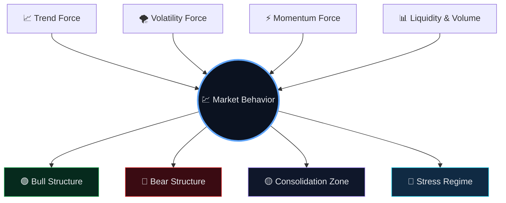
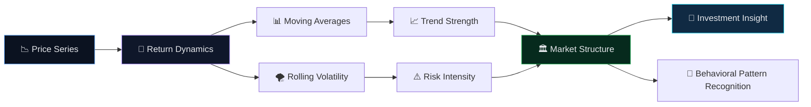

<!-- ===================================================== -->
<!--   Stock Market Analysis — README.md (Premium)         -->
<!--   Classy • Visual • Interactive • Recruiter-Ready     -->
<!-- ===================================================== -->

<!-- ✅ SAME BRAND BANNER STYLE -->

 

  

<a href="#-project-overview"><b>Overview</b></a> •
<a href="#-financial-problem"><b>Problem</b></a> •
<a href="#-creative-workflow"><b>Workflow</b></a> •
<a href="#-analysis-framework"><b>Framework</b></a> •
<a href="#-why-this-project-matters"><b>Impact</b></a> •
<a href="#-contact"><b>Contact</b></a>

---

## 📈 Project Overview

This project performs **exploratory financial data analysis** on stock market time-series data to extract:

- Trend patterns  
- Volatility behavior  
- Moving averages & signal insights  
- Market behavior interpretation  

It demonstrates **time-series thinking + analytical storytelling**, not just plotting graphs.

---

## 💹 Financial Problem

Markets generate massive time-dependent data.  
The goal is to:

- Understand price behavior over time  
- Detect trend structures  
- Identify volatility regimes  
- Extract interpretable financial signals  

This is an exercise in **structured time-series exploration**.

---

## 🎯 Market Intelligence Model

<b>💹 Financial Signal Ecosystem (click to collapse)</b>

 

---

## 🔬 Analytical Interpretation Framework

<b>📊 From Raw Prices to Market Narrative (click to collapse)</b>

 

---

## 📊 Key Analytical Themes

<table>
<tr>
<td width="33%" align="center" valign="top">

### 📈 Trend Analysis
- Rolling mean  
- Short vs long window comparison  
- Momentum signals  

</td>

<td width="33%" align="center" valign="top">

### 🌪 Volatility Insight
- Rolling standard deviation  
- Market instability detection  
- Risk perception modeling  

</td>

<td width="33%" align="center" valign="top">

### 🧠 Interpretation Layer
- Behavioral patterns  
- Regime change signals  
- Narrative-driven analysis  

</td>
</tr>
</table>

---

## 🎯 Why This Project Matters

<table>
<tr>
<td width="33%" align="center" valign="top">

### 🧠 Technical Skill

- Time-series handling  
- Rolling window logic  
- Data cleaning & indexing  
- Structured financial analytics  

</td>

<td width="33%" align="center" valign="top">

### 📊 Analytical Depth

- Pattern detection  
- Volatility interpretation  
- Comparative trend analysis  
- Insight synthesis  

</td>

<td width="33%" align="center" valign="top">

### 🚀 Practical Relevance

- Market signal extraction  
- Risk understanding  
- Investment insight foundation  
- Financial storytelling  

</td>
</tr>
</table>

---

## 🤝 Contact

  
Stock Market Analysis — structured time-series analytics with interpretive insight.

